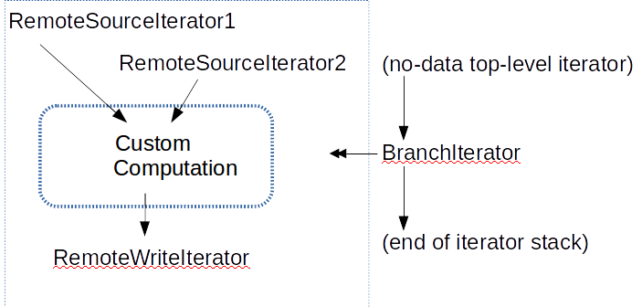

Accumulo Server-Side Computation: Stored Procedure Tables starring SpGEMM
---
Goal: to implement the concept of a stored procedure in Accumulo. 
We will use SpGEMM, sparse matrix multiplication, as a motivating algorithm.

##Background & Requirements
Accumulo is well-known as a high performance NoSQL DB with respect to ingest and scans.
The next step past ingesting and scanning is computing-- running algorithms and analytics.
The advantage of doing computing on data in a DB like Accumulo, as opposed to YARN or MapReduce directly on HDFS, is **selective access**.  Database indices deliver fast access to selected data subsets.

More specifically, let's assume we have a series of computations, taking input from an Accumulo table and writing output to an Accumulo table.  
To take full advantage of a database, we take the case of *queued* computations.  "Queued" means computations that run on a subset of an Accumulo table, as opposed to "whole-table" computations that are better running directly off RFiles.  The subset is not too large, such that we can make the requirement that a whole row fits in the memory of a tablet server if it helps an algorithm, for example.
We would further like computation results ready for scanning as soon as possible, ideally in a streaming fashion as they emit one-by-one from a computation.  *Low latency* complements our emphasis on queued computation, rather than high throughput.

One way to do computations is client-side: a client queries the table with a (Batch)Scanner, computes locally, and writes results back to Accumulo via a BatchWriter.  Sure, this works, but why move data to the client when our end goal is to persist results in Accumulo?

The option we examine here is server-side computation.  Let's list a few kinds of server-side computations:

1. Single-table run-many.  These computations become *properties of the table*, run on data currently in the table and on data entering the table in the future.  Combiners, filters, really any idempotent function wrapped inside an iterator applied to all scopes works great.  A function $f$ is idempotent if $f(x) = f(f(x))$.
2. Single-table run-once, sending results to a client.  Apply the computation as a scan-scope iterator and scan the appropriate ranges.
3. Single-table run-once, persisting results to Accumulo.  Apply the computation during a one-time manual major compaction on the appropriate ranges with an iterator attached.  A downside is that no one sees results until the major compaction completes.
4. Multi-table (meaning more than one table source) run-once, persisting results to Accumulo.  This is our use case.  

Think of a computation's result as an output table.  The table may be *permanent*, i.e. a table we want to store in Accumulo permanently, or it may be *temporary*, a table generated in the middle of an algorithm (= a series of computations) meant to be fed into succeeding computations.  Both cases are in scope.

SQL-like Stored procedures naturally capture the concept of server-side computation.  
In many ways iterators are stored procedures, because iterators are user-defined pieces of code stored in JARs in a directory accessible to, loaded by and executed on Accumulo tablet servers.  

The iterator framework is not as general as stored procedures, forcing code to follow the paradigm of init(), seek(), next() and the other [SKVI][] methods, and the iterator framework forbids full lifecycle control to iterator code (iterators may be re-seeked and destroyed-&-restarted arbitrarily as Accumulo sees fit).  There are very good performance reasons for these requirements; we should try to respect them rather than change Accumulo core to relax them.

The design below aims to logically separate run-once computation, particularly multi-table computation, from computation that is a property of table or a property of a single scan.
To do so with minimal hacking and changes to Accumulo core, 
we propose a new use of Accumulo tables--tables that do not hold concrete data and instead store procedure code in the form of one-time compaction iterators.

##Accumulo Stored Procedure Table Design
We envision a stored procedure table as a regular Accumulo table without any data.  Instead of data, the crux of the table is its table splits and iterators.  We "execute" a stored procedure table by manually starting a full major compaction.
We may also think of a stored procedure table as an "Accumulo client run on and distributed over the Accumulo server."

Table splits define computation parallelism. Iterators on the table may execute over each tablet in parallel, depending on tablet server availability.  Depending on other tables involved in the computation, it may be advantageous to align a stored procedure table's splits with the table splits of tables involved in the computation.

Iterators on the stored procedure table access other tables via Scanners and BatchWriters.  We create the scanners and writers as any ordinary client would, supplying a zookeeper address, instance name, table name, username and password (!! - todo: explore other [AuthenticationToken][] means).
We may be able to special case a stored procedure table scanning and writing to tables *in the same Accumulo instance* via non-public APIs or other config information.

Also just as an ordinary client, scanners and writers consume thread resources on the tablet server executing one.  
Future work should include facilities to *monitor tablet server resource usage* to throttle a stored procedure table's resource usage if necessary.  Right now we hope resource issues are handled behind the scenes.  On the plus side, Accumulo offers a guarantee that iterators at major compaction time are never killed until tablet compaction completes, barring tablet server failure or exception.

A RemoteSourceIterator class wraps up a Scanner in such a way that it 

1. can be configured at runtime using [IteratorOptions][] in the form of `Map<String,String>`, 
2. gracefully handles re-seeks and thread-death-and-restart, and 
3. matches the SortedKeyValueIterator ([SKVI][]) interface so that we can use the same RemoteSourceIterator in a normal iterator tree if desired.  

Extensions may apply a Filter or WholeRowIterator or something else, to run on the remote table's tablet server.

A mostly complete implementation of [RemoteSourceIterator][] is here in Graphulo project code.   
The RemoteSourceIterator ignores (= replaces) its source iterator.  An alternative implementation, say [RemoteMergeIterator][] can merge entries from a RemouteSourceIterator with a parent source.

We imagine a RemoteWriteIterator that writes data to an Accumulo table analogous to a RemoteSourceIterator.
If the end goal of an iterator setup is a RemoteWriteIterator, such as one in a stored procedure table, then returning results in sorted order no longer matters.  We may use a BatchScanner in such instances.

The following depicts a general outline of a stored procedure table:



The BranchIterator is the only iterator in the traditional SKVI stack.  When Accumulo calls init() on the BranchIterator, it sets up and wires together the custom iterator stack, much like how Accumulo wires together traditional iterator stacks from parent to child.  
When Accumulo calls seek( rng ) on the BranchIterator, it calls seek() on the RemoteWriteIterator which in turn propagates the seek() call up the custom iterator stack.  The RemoteWriteIterator then in turn starts the chain by processing top values from the custom computation and calling next() until hasTop() on the parent of RemoteWriteIterator is false.
At that point, the BranchIterator's seek( rng ) returns, the BranchIterator's hasTop() will return false, Accumulo will see that the iterator stack has no more values, and the compaction will complete (for that seek range, likely a tablet's length).
This whole scheme runs in parallel for each tablet (defined by table splits) on the stored procedure table.

##SpGEMM Application
We now turn to a specific application that will implement a SKVI table.

Sparse general matrix-matrix multiplication (SpGEMM) is a building block for many algorithms.  It is also the core algorithm of the emerging [GraphBLAS][] standard.
See [slide 19 from the 2014 GABB workshop][GABB2014slides] for a one-slide overview of GraphBLAS, and see [a draft book chapter][GraphBLAS-math] for an overview of the GraphBLAS mathematics.

###Example 
Here is a diagram illustrating SpGEMM on Accumulo tables.  Assume column family and visibility are empty.
A1 and A2 are rows of table A, B1 and B2 are rows of table transpose(B), C1, C2 and C3 are column qualifiers.
Assume traditional numeric addition and multiplication, no table C to merge results into, tableR result table, and no row or column subsetting (see API below for options).
```
    tableA     tableBT          tableR
     C1 C2        C1 C2 C3          B1  B2
A1 [ 2  3 ] * B1 [   3  3  ] = A1 [ 9   15  ]
A2 [ 2    ]   B2 [3  3     ]   A2 [     6   ]
```
The value (row A1, colQ B2, val 15) entry is formed from the multiplications $2*3=6$, $3*3=9$, and the sum combine $6+9=15$.

###Client API
We imagine a user invokes the SpGEMM as a stored procedure via the following  method call signature:
```Java
/**
 * Create and execute the stored procedure table Ptable
 * to compute R := C + A (*.+) B.
 * A (*.+) B means A "times" B with user-defined "plus" and "multiply".
 * 
 * @param Ptable Name of the "stored procedure table" to hold computation iterators.
 * @param Atable Name of Accumulo table holding matrix A.
 * @param Arows  Optional. Row subset of Atable.
 * @param BTtable Name of Accumulo table holding matrix transpose(B).
 * @param BTrows Optional. Row subset of BTtable.
 * @param Ctable Optional. A table we add to the result of A (*.+) B.
 * @param Rtable Table to store the result.
 * @param multOp An operation that "multiplies" two values.
 * @param sumOp  An operation that "sums" values.
 * @param colFilter Optional. Column family/qualifier subset of A and BT.
 *                  A variant takes a collection of ranges. This is less efficient since
 *                  {@link org.apache.accumulo.core.client.ScannerBase#fetchColumn} and fetchColumnFamily
 *                  do not take ranges (meaning, need to scan all the columns and filter after receiving,
 *                  or use a {@link org.apache.accumulo.core.iterators.Filter}). Row subsets are easier than column.
 */
public void TableMult(String Ptable,
                   String Atable, Collection<Range> Arows,
                   String BTtable, Collection<Range> BTrows,
                   String Ctable, String Rtable,
                   IMultiplyOp multOp, Combiner sumOp,
                   Collection<IteratorSetting.Column> colFilter);
```

`IMultiplyOp` is a simple interface with the following signature:
```Java
public Value multiply(Value v1, Value v2);
```

TableMult will create new table P, apply appropriate table splits (todo),
setup the appropriate iterator stack at one-time compaction-scope
and initiate the compaction.

We expect the user may start reading from table R a couple seconds after calling TableMult.  We may make the function block until it is safe to do so.

Detail: If we initialize the row subset or column filter from a `Map<String,String>` iterator option map, then we need to have a way to format a list of row ranges as a string and parse the row ranges back into a collection of ranges.  Subsets across the rows are fairly simple.  The column filter is a tad more complicated because it is composed of column families and qualifiers.  Maybe something like `row1,*,row4,row6,row8,*,` to indicate the row ranges `[row1,row4] U [row6,row6) U [row8,+inf)`.  This is not quite right since the characters `*` and `,` may appear in the rows; we may avoid character conflicts by making the characters dynamic, say, the last two characters in a string, and choosing ones guaranteed not to be in the string.  A column family-qualifier separator might be `:` as in the Accumulo shell. Or Accumulo may already have a string encoding/decoding of ranges.

###Stored Procedure Stack Implementation
In words, SpGEMM 

1. scans rows of tableA, 
2. for each row of tableA, scan rows with columns matching the ones from that row in tableBT
3. For each value pair, the first from tableA and the second from tableBT and both matching column family/qualifier, multiply the two values and emit them, setting the row to that from tableA and the column to the row from tableBT.
4. Sum entries with identical rows and columns.
5. Write results to the output table.

The following diagram illustrates the framework:


###Discussion
Using a custom iterator stack means we avoid the overhead of deserializing and reserializing keys and values repeatedly from their Hadoop `Text` form, as may happen if many iterators are placed in a traditional iterator stack.  

Not worrying about handling column visibility and authorizations for now.  They will become important later as cell-level visibility is a big selling point for Accumulo.

It is completely possible to combine the stored procedure table-style iterators with traditional iterators both on source and result tables.  
For example, the Scanner inside a RemoteSourceIterator may configure a one-time scan-scope iterator that does filtering, combining, whole-rowing or something else entirely, such that the configure iterator runs on the tablet server of the remote source table and not on the stored procedure table.  
As another example, the result table (with pre-set table splits) may have a permanent-property-style iterator configure on all scopes, such that some computation is done at the location of the result table when data is written via the BatchWriter inside a RemoteWriteIterator.
There does not seem to be a uniform strategy for **where to place iterators**; it seems each cluster and problem needs analysis to determine the iterator placement that maximizes parallelism and load balancing given limited tablet server resources.  Open to comments.

Table cloning may save some computation.  In the case of `D = C + A (*,+) B`, for example,
we gain efficiency by cloning C into new table D, and then placing the sum Combiner iterator as a permanent-property-all-scope iterator on new table D, instead of doing the sum combining within the stored procedure table.

Optimizing parameters such as the readahead threshold and batch size of a Scanner seems challenging.  There are many other parameters: number of compaction threads, number of scan and write threads, defining split locations, maybe even things like bloom filters or the other myriad parameters Accumulo has.

A nice benefit to using compactions as the exection engine for one-time computation is better *interactive computing* support: that we may stop the computation by canceling the compaction.  We imagine a user scanning a computation's result table to see what the computation results "look like" as they complete, and also to monitor how many results come in.  The user will stop a computation if he doesn't like where it is going, or if he has enough results to work with at the next step.


###Transpose: A Non-Sorted-Order Computation
As an example of a computation that does not output values in sorted order, take the use case of computing the transpose of a subset of an Accumulo table and storing the transposed subset in another table.  Taking the transpose here means switching entries' row and column qualifier.  The custom iterator stack is simple:
```
RemoteSourceIterator
|
v
Switch-Row-Col
|
v
RemoteWriteIterator
```
As in SpGEMM, we invoke the custom iterator stack from a BranchIterator run once at compaction of a table with no data.

##Temporary Tables
Imagine we have several operations we want to compute in sequence.  
For example, we may 

1. Start with tables A and B, 
2. compute C := A*B, 
3. then D = transpose(C), 
4. then E = D + A\*D.

If our final goal is to compute table E in Accumulo without care for C and D, then we waste time in writing table C and D.  Here are a few options to consider:

1. Combine iterator stacks.  In the above computations, we see that after creating table C at step #2, C is only used once, in step #3.  We may perform step #3's computations in the same compaction as step #2 by appending the "switch-row-col" step to SpGEMM, before writing an output table.
2. Restructure the computation.  If we had access to table AT = transpose(A) and table BT = tranpose(B), then we could directly compute D := BT*AT and omit creating C entirely.  
3. Keep the status quo. Maybe there won't be much of a performance hit, especially if Accumulo never flushes table C, which means that C always remains in memory and never hits HDFS.  We may delete table C when no longer needed.  Same for table D.
4. Somehow designate tables C and D as "please-keep-in-memory" tables for fast access in the midst of an algorithm.  We have to flush to disk if we run out of memory of course (or use swap space).  
We may even create a namespace for all the temporary tables in an algorithm, dropping the entire namespace at the end of the algorithm (if we do not drop all the component temporary tables sooner).

There is also the matter of how step #3 runs after step #2.  The safest option is to block step #3 until step #2's compaction completes, effectively placing a [barrier][] after every computation.  The barrier is particularly important if step #2 wrote entries to its output table C out of order.  However, if step #2 writes entries in order, step #3 should be able to run concurrent with step #2 as #2 streams entries.

The [Fluo][] implementation of percolator in Accumulo has some lessons we could learn from here for incremental processing.  Not sure if we need the transactional component, unless we break up a computation into many independent transactions for parallelism.  Using the timestamp is another good idea.

Right now my intuition says that table splits are a good enough level of parallelism, and that we could put barriers on the tablet level, i.e., when a tablet completes, the next stage algorithm can start reading from that tablet.  We can implement tablet-level barriers by starting the next stage's compaction on tablets *as they finish* from the previous stage.  Luckily we have ways of monitoring the status of major compaction, including blocking [compact()][] calls and the [getActiveCompactions()][] instance operation.


[GraphBLAS]: http://istc-bigdata.org/GraphBlas/
[GABB2014slides]: http://www.graphanalysis.org/IPDPS2014-workshop/Mattson.pdf
[GraphBLAS-math]: http://www.mit.edu/~kepner/GraphBLAS/GraphBLAS-Math-release.pdf
[AuthenticationToken]: https://accumulo.apache.org/1.6/apidocs/org/apache/accumulo/core/client/security/tokens/AuthenticationToken.html
[IteratorOptions]: https://accumulo.apache.org/1.6/apidocs/org/apache/accumulo/core/iterators/OptionDescriber.IteratorOptions.html
[SKVI]: https://accumulo.apache.org/1.6/apidocs/org/apache/accumulo/core/iterators/SortedKeyValueIterator.html
[RemoteSourceIterator]: https://github.com/Accla/d4m_api_java/blob/master/src/main/java/edu/mit/ll/graphulo/RemoteSourceIterator.java
[RemoteMergeIterator]: https://github.com/Accla/d4m_api_java/blob/master/src/main/java/edu/mit/ll/graphulo/RemoteMergeIterator.java
[compact()]: <https://accumulo.apache.org/1.6/apidocs/org/apache/accumulo/core/client/admin/TableOperations.html>
[getActiveCompactions()]: https://accumulo.apache.org/1.6/apidocs/org/apache/accumulo/core/client/admin/InstanceOperations.html#getActiveCompactions(java.lang.String)
[barrier]: https://en.wikipedia.org/wiki/Barrier_%28computer_science%29
[fluo]: http://fluo.io/
